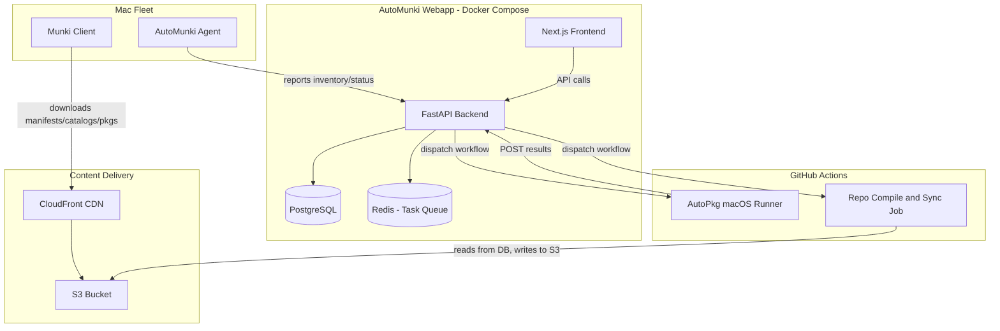
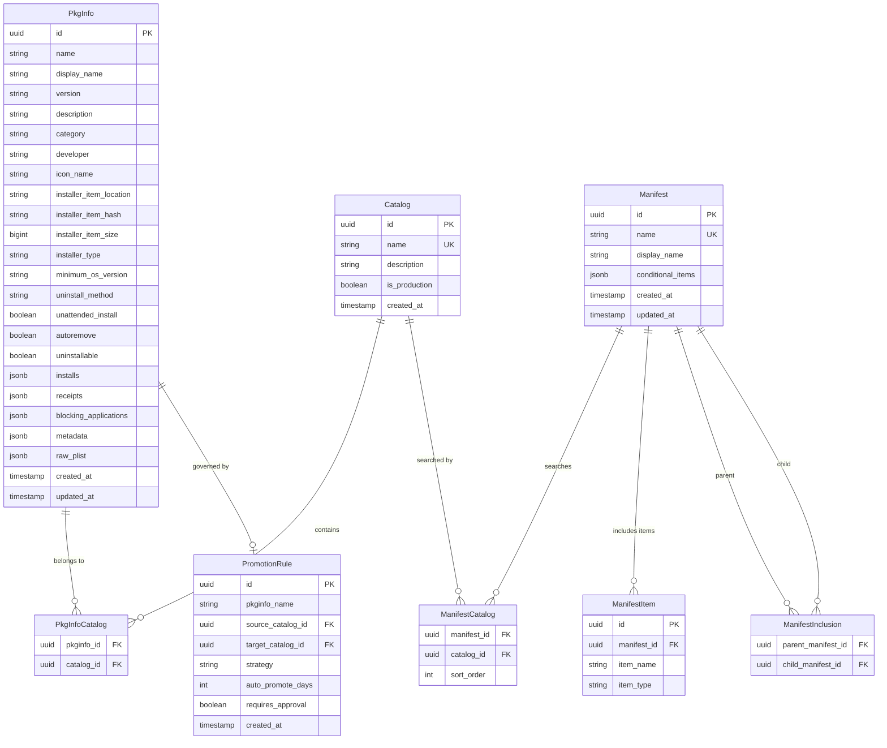
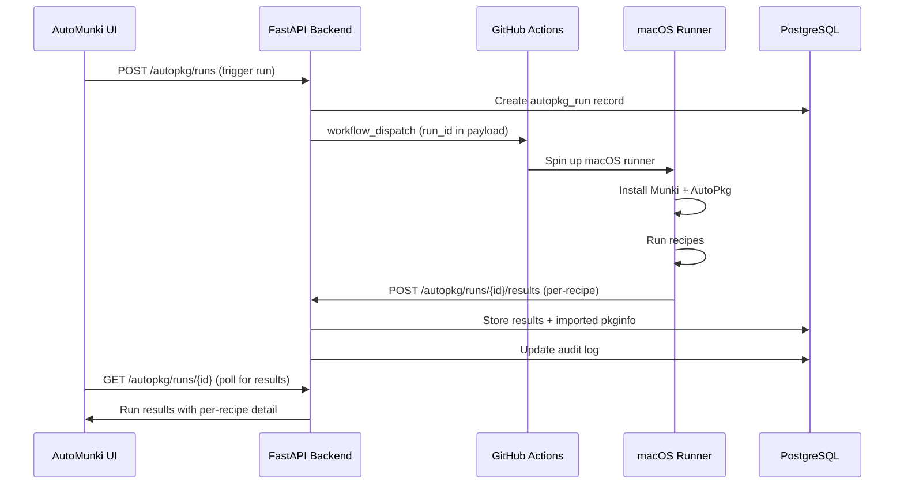

# AutoMunki Webapp - Architecture and Implementation Plan

## High-Level Architecture




---

## Phase 0: Foundation and Data Layer (MVP Priority)

This is the critical first phase - getting the data model right and importing existing data.

### Database Schema Design

ORM recommendation: **SQLAlchemy 2.0** with async support. It's the most mature Python ORM, pairs natively with Alembic, has excellent Postgres support (JSONB, arrays, enums), and the 2.0 API is clean and type-safe. SQLModel is tempting but less battle-tested for complex schemas.

Core entities and their relationships:




Additional tables (second layer):

- `**autopkg_recipes**` - recipe overrides, parent recipe references, trust info, configuration
- `**autopkg_repos**` - tracked recipe repositories (synced from GitHub autopkg org)
- `**autopkg_runs**` - run history (trigger type, start/end time, status)
- `**autopkg_run_results**` - per-recipe results within a run (pass/fail, imported items, logs, VirusTotal data)
- `**audit_log**` - full compliance audit trail (user, action, entity, before/after JSONB snapshots, timestamp)
- `**users**` / `**sessions**` - auth tables (FastAPI-Users)
- `**client_machines**` - reported fleet inventory (serial, hostname, OS version, hardware)
- `**client_install_reports**` - per-machine install status (what's installed, pending, failed)
- `**sync_jobs**` - repo compilation and S3 sync job tracking
- `**icons**` - icon metadata + S3 path references

### Key schema decisions

- `**raw_plist**` JSONB column on PkgInfo: preserves the original plist data for lossless round-tripping. The structured columns (name, version, etc.) are extracted for querying. When compiling the repo, we can reconstruct plists from structured data or fall back to raw_plist.
- `**item_type**` enum on ManifestItem: `managed_installs`, `managed_uninstalls`, `managed_updates`, `optional_installs`, `featured_items`, `default_installs`
- `**strategy**` enum on PromotionRule: `manual`, `auto_time`, `auto_approve`, `auto_immediate`
- Postgres JSONB for semi-structured data (installs, receipts, conditional_items) that varies per pkginfo but still needs to be queryable.

### Data import script

A one-time CLI command (`python -m automunki.cli import-repo /path/to/repo`) that:

1. Walks `pkgsinfo/` and parses each plist into PkgInfo rows
2. Collects unique catalog names and creates Catalog rows
3. Populates PkgInfoCatalog junction table
4. Parses `manifests/` into Manifest + ManifestItem + ManifestInclusion rows
5. Imports recipe overrides from `autopkg_src/overrides/` into autopkg_recipes
6. Imports `recipe_list.json` and `repo_list.txt`
7. Logs the import as an audit event

---

## Phase 1: Backend API (FastAPI)

### Project structure (monorepo)

```
automunki/
├── autopkg_src/              # existing AutoPkg automation (stays)
├── backend/
│   ├── alembic/              # migrations
│   ├── automunki/
│   │   ├── api/
│   │   │   ├── routes/
│   │   │   │   ├── pkginfo.py
│   │   │   │   ├── manifests.py
│   │   │   │   ├── catalogs.py
│   │   │   │   ├── autopkg.py
│   │   │   │   ├── recipes.py
│   │   │   │   ├── sync.py
│   │   │   │   ├── audit.py
│   │   │   │   └── auth.py
│   │   │   └── deps.py       # dependency injection
│   │   ├── models/           # SQLAlchemy models
│   │   ├── schemas/          # Pydantic request/response schemas
│   │   ├── services/         # business logic
│   │   │   ├── munki.py      # plist generation, catalog compilation
│   │   │   ├── autopkg.py    # GitHub Actions dispatch, result ingestion
│   │   │   ├── promotion.py  # promotion engine
│   │   │   ├── s3.py         # S3 upload/sync coordination
│   │   │   └── audit.py      # audit logging
│   │   ├── core/
│   │   │   ├── config.py     # settings via pydantic-settings
│   │   │   ├── security.py   # auth
│   │   │   └── db.py         # async engine/session
│   │   └── cli/              # management commands (import, compile, etc.)
│   ├── tests/
│   ├── Dockerfile
│   ├── pyproject.toml
│   └── alembic.ini
├── frontend/                 # Next.js app
├── docker-compose.yml
├── .github/workflows/
│   ├── autopkg.yml           # existing (modified to POST results to API)
│   ├── repo-sync.yml         # new: compile repo and sync to S3
│   └── deploy.yml            # new: build and deploy webapp
└── docs/
```

### Core API endpoints

**PkgInfo Management**

- `GET /api/v1/pkginfo` - list/search/filter (TanStack Table compatible pagination)
- `GET /api/v1/pkginfo/{id}` - detail with full metadata
- `PUT /api/v1/pkginfo/{id}` - update (triggers audit log)
- `DELETE /api/v1/pkginfo/{id}` - soft delete
- `POST /api/v1/pkginfo/{id}/promote` - promote to target catalog

**Manifest Management**

- `GET /api/v1/manifests` - list with hierarchy info
- `GET /api/v1/manifests/{id}` - detail with resolved items
- `POST /api/v1/manifests` - create
- `PUT /api/v1/manifests/{id}` - update
- `GET /api/v1/manifests/{id}/effective` - resolved view (all included manifests flattened)

**Catalog Management**

- `GET /api/v1/catalogs` - list with item counts
- `GET /api/v1/catalogs/{id}/items` - items in a catalog
- `POST /api/v1/catalogs/{id}/compile` - generate plist output

**AutoPkg**

- `POST /api/v1/autopkg/runs` - trigger a run (dispatches GitHub Action)
- `GET /api/v1/autopkg/runs` - run history
- `GET /api/v1/autopkg/runs/{id}` - run detail with per-recipe results
- `POST /api/v1/autopkg/runs/{id}/results` - webhook endpoint for runner to POST results
- `GET /api/v1/autopkg/recipes` - managed recipes
- `PUT /api/v1/autopkg/recipes/{id}` - update override config
- `GET /api/v1/autopkg/recipes/discover` - browse autopkg org repos

**Repo Sync**

- `POST /api/v1/sync/compile` - trigger repo compilation + S3 sync
- `GET /api/v1/sync/status` - current sync status
- `GET /api/v1/sync/history` - sync history

**Audit**

- `GET /api/v1/audit` - filterable audit log (who, what, when, entity type)
- `GET /api/v1/audit/{entity_type}/{entity_id}` - history for specific entity

**Auth** (FastAPI-Users based)

- `POST /api/v1/auth/register`, `POST /api/v1/auth/login`, `POST /api/v1/auth/logout`
- `GET /api/v1/users/me`, `PATCH /api/v1/users/me`

### Auth approach

Use **FastAPI-Users** library which provides:

- JWT token auth (access + refresh tokens)
- Pluggable backends (SQLAlchemy, MongoDB, etc.)
- Password hashing, email verification
- OAuth2 support for future SSO
- Built-in user management routes

Architect role fields on the User model now (role enum: admin, editor, viewer) but don't enforce RBAC checks until needed.

### Audit logging

Implement as SQLAlchemy event listeners + a service:

- Every create/update/delete on audited models triggers an audit_log entry
- Stores: `user_id`, `action` (create/update/delete/promote/approve), `entity_type`, `entity_id`, `before_snapshot` (JSONB), `after_snapshot` (JSONB), `timestamp`, `ip_address`
- Promotion events include: who promoted, from/to catalog, approval chain
- Queryable via the audit API with filters

---

## Phase 2: Frontend (Next.js + React)

### Tech stack

- **Next.js** (App Router) with **Bun** as runtime/package manager
- **TanStack Table** for all data grids (pkginfo list, run history, fleet inventory)
- **shadcn/ui** component library + **Tailwind CSS**
- **TanStack Query** for data fetching/caching
- **React Hook Form** + **Zod** for form validation

### Key pages/views

1. **Dashboard** - overview cards (total titles, pending updates, last run status, fleet health)
2. **Software Catalog** (`/software`) - TanStack Table of all pkginfo with:
  - Filter by catalog, category, name
  - Inline status badges (which catalogs it's in)
  - Bulk actions (promote, delete)
  - Click through to detail view
3. **Software Detail** (`/software/:id`) - full pkginfo view with:
  - Edit form for all fields
  - Promotion controls (promote to catalog X)
  - Version history timeline
  - Audit trail for this item
4. **Manifests** (`/manifests`) - tree/hierarchy view of manifests
  - Visual editor for managed_installs, optional_installs, etc.
  - Drag-and-drop reordering
  - Included manifest visualization
5. **Catalogs** (`/catalogs`) - catalog overview with item counts
  - Compare catalogs (what's in test but not production?)
6. **AutoPkg Runs** (`/autopkg/runs`) - run history table
  - Status indicators, expandable rows for per-recipe results
  - Trigger new run button
  - Logs viewer
7. **Recipe Management** (`/autopkg/recipes`) - configured recipes
  - Discovery browser to find new recipes
  - Override editor
  - Enable/disable toggle
  - Trust status indicator
8. **Approval Queue** (`/approvals`) - items pending approval
  - Trust updates, manual promotions, new imports
  - Approve/reject with comments
9. **Sync Status** (`/sync`) - repo compilation and S3 sync status
  - Trigger sync button
  - History of syncs with diff summary
10. **Audit Log** (`/audit`) - full searchable audit trail
11. **Settings** (`/settings`) - S3 config, schedule config, notification settings

### Design system

- Dark mode by default (IT admin tool aesthetic)
- shadcn/ui provides a clean, professional baseline
- Status colors: green (current/synced), yellow (pending/in-progress), red (failed/outdated)
- Use shadcn data table recipe as the foundation for TanStack Table integration

---

## Phase 3: AutoPkg Integration

### Modified workflow




### Changes to existing [autopkg_tools.py](autopkg_src/autopkg_tools.py)

The existing script stays largely intact but gains a new "report to API" path:

1. Accept a `--run-id` and `--api-url` argument
2. After each recipe completes, POST results to the API instead of (or in addition to) creating Git PRs
3. For items configured as auto-promote: results go straight into DB as new PkgInfo in the target catalog
4. For items requiring approval: results are marked as "pending approval" in the DB
5. Trust failures always create approval requests
6. The existing Slack notification can remain or be replaced by the API's notification system

### Recipe discovery service

A background task or scheduled job that:

1. Queries the GitHub API for all repos in the `autopkg` org
2. Parses recipe metadata from each repo
3. Stores in `autopkg_repos` and a `discoverable_recipes` table
4. The UI can then browse/search this catalog and create overrides

---

## Phase 4: Repo Compilation and S3 Sync

### Compilation service

When triggered (on-demand via UI or scheduled):

1. API dispatches `repo-sync.yml` GitHub Action
2. The action calls the API to fetch all data needed:
  - `GET /api/v1/catalogs/{id}/compile` for each catalog (returns plist XML)
  - `GET /api/v1/manifests/{id}/compile` for each manifest (returns plist XML)
  - PkgInfo files are also compiled from DB
3. Writes files to a temp directory matching Munki repo structure:

```
   catalogs/all, catalogs/test, catalogs/production
   manifests/site_default, manifests/department_engineering, ...
   pkgsinfo/GoogleChrome-120.0.6099.129.plist, ...


```

1. Syncs to S3: `aws s3 sync ./repo/ s3://$BUCKET/ --delete`
2. Invalidates CloudFront cache
3. Reports sync status back to the API

### Alternative: direct S3 writes

For urgent changes, the backend could write individual files to S3 directly (e.g., updating a single manifest) without a full recompilation. The full sync would then be a consistency check.

---

## Phase 5: Client Reporting (Secondary Goal)

### Custom agent design

A lightweight Python or Swift agent installed on managed Macs that:

1. Runs after Munki checks (triggered by Munki's postflight or launchd)
2. Collects:
  - Munki install results (`/Library/Managed Installs/Logs/`)
  - Hardware inventory (serial, model, CPU, RAM, disk)
  - OS version, build number
  - Installed software versions (from Munki's `ApplicationInventory.plist`)
  - Pending installs/updates
3. POSTs to `POST /api/v1/reports/checkin`
4. The API stores this in `client_machines` and `client_install_reports`

### Fleet reporting views (frontend)

- Machine list with search/filter
- Per-machine detail (installed software, pending updates, compliance status)
- Compliance dashboard (% up to date, machines needing attention)
- Software coverage (which machines have app X installed?)

---

## Phase 6: Observability and Operations

### Logging

- Structured JSON logging throughout the backend (using `structlog`)
- Request ID tracking across API calls
- Log aggregation ready (stdout for Docker, compatible with any log collector)

### Monitoring

- `/health` and `/ready` endpoints for container orchestration
- Prometheus metrics endpoint (via `prometheus-fastapi-instrumentator`)
- Key metrics: API latency, DB query time, sync duration, run duration

---

## Docker Compose Setup

```yaml
services:
  db:
    image: postgres:16
    volumes: [pgdata:/var/lib/postgresql/data]
    environment: [POSTGRES_DB, POSTGRES_USER, POSTGRES_PASSWORD]

  backend:
    build: ./backend
    depends_on: [db]
    environment: [DATABASE_URL, SECRET_KEY, AWS_*, GITHUB_*]
    ports: ["8000:8000"]

  frontend:
    build: ./frontend
    depends_on: [backend]
    environment: [NEXT_PUBLIC_API_URL]
    ports: ["3000:3000"]
```

---

## Technology Summary


| Component     | Technology                     | Rationale                                          |
| ------------- | ------------------------------ | -------------------------------------------------- |
| Backend       | FastAPI + Python 3.12          | Async, typed, matches existing Python codebase     |
| ORM           | SQLAlchemy 2.0 (async)         | Most mature, native Alembic support, JSONB support |
| Migrations    | Alembic                        | Standard for SQLAlchemy                            |
| Database      | PostgreSQL 16                  | JSONB for plist data, robust, enterprise-grade     |
| Auth          | FastAPI-Users                  | Python-native, JWT, OAuth2-ready, pluggable        |
| Frontend      | Next.js 15 + Bun               | Modern React, SSR capability, fast builds          |
| UI            | shadcn/ui + Tailwind CSS       | Clean, accessible, customizable                    |
| Tables        | TanStack Table                 | Best-in-class data grid with server-side support   |
| Data fetching | TanStack Query                 | Caching, pagination, optimistic updates            |
| Containers    | Docker Compose                 | Flexible deployment, works anywhere                |
| CI/CD         | GitHub Actions                 | Already in use, macOS runners available            |
| CDN           | CloudFront + S3                | Client package delivery                            |
| API docs      | Auto-generated OpenAPI/Swagger | FastAPI provides this automatically                |


---

## Implementation Order

The phases above are roughly ordered by priority, but within each phase, work can be parallelized across frontend and backend. The recommended build order:

1. **Phase 0**: DB schema + Alembic migrations + import script (backend only)
2. **Phase 1a**: Core CRUD API endpoints (pkginfo, manifests, catalogs)
3. **Phase 1b**: Auth setup
4. **Phase 2a**: Frontend scaffolding + software catalog page
5. **Phase 1c**: AutoPkg API endpoints
6. **Phase 3**: Modify autopkg_tools.py to report to API
7. **Phase 2b**: AutoPkg dashboard UI
8. **Phase 4**: Repo compilation + S3 sync
9. **Phase 2c**: Remaining frontend pages (approvals, audit, settings)
10. **Phase 5**: Client reporting (agent + fleet dashboard)
11. **Phase 6**: Observability polish
